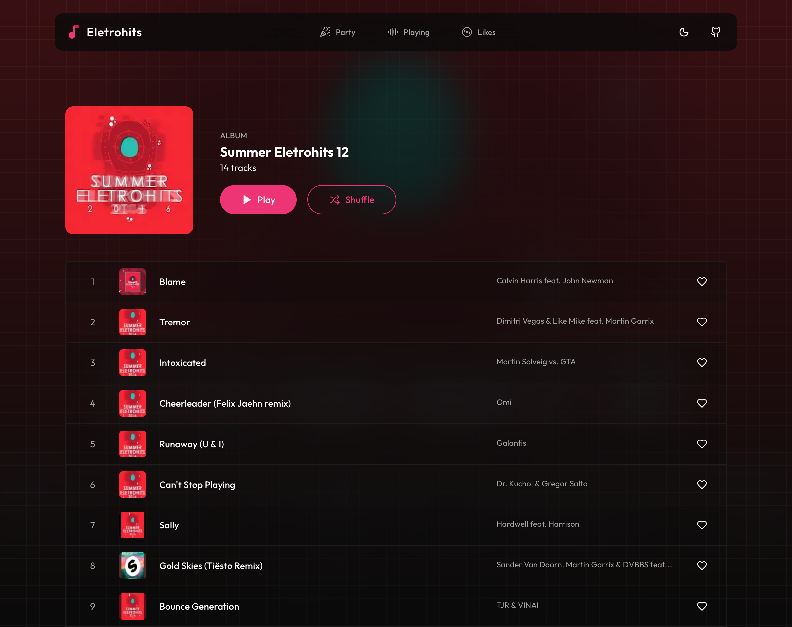

# Eletrohits

Eletrohits is a web player application built with Next.js, designed for streaming and enjoying electronic music.



# Technologies

- Next 15
- Tailwind
- Shadcn UI
- Typescript
- Zustand
- Axios

## Getting Started

To run Eletrohits locally, follow these steps:

1. Clone the repository
2. Install dependencies:
   ```bash
   pnpm install
   ```
3. Copy the `.env.example` file to `.env` and update the variables:
   ```bash
   cp .env.example .env
   ```
4. Start the development server:
   ```bash
   pnpm dev
   ```
5. Open [http://localhost:3000](http://localhost:3000) in your browser

## Environment Variables

Eletrohits uses environment variables for configuration. A `.env.example` file is provided as a template. Copy this file to `.env` and update the values as needed (value already set):

```
NEXT_PUBLIC_API_URL=https://www.eletrohits-api.vini.one
```
## Contributing

We welcome contributions to Eletrohits! If you find a bug, please create an issue in our GitHub repository.

## License

Eletrohits is released under the [MIT License](LICENSE).
